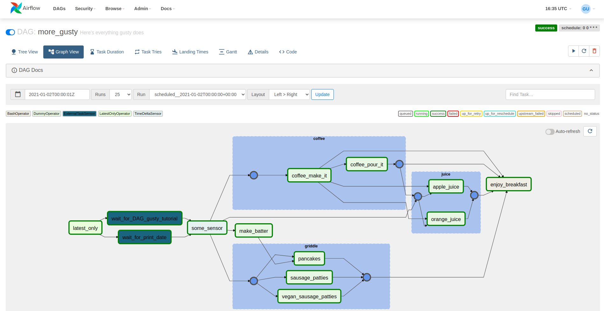

This is a very light demonstration of how the [gusty package](https://github.com/chriscardillo/gusty) works with [Airflow](https://airflow.apache.org/) to assist in the organization, construction, and management of DAGs, tasks, dependencies, and operators. It requires that you have [Docker](https://docs.docker.com/get-docker/) and [Docker Compose](https://docs.docker.com/compose/install/) installed on your machine.

## TL;DR

gusty takes YAML specifications of individual tasks and converts those specs into full Airflow DAGs. gusty includes full support for Airflow DAGs, task groups, tasks, dependencies, external dependencies, and more.

If don't have time to run the demo, please check out the ["Why You Should Try gusty" section below](#why-you-should-try-gusty).

Lastly, here is how gusty renders the [more_gusty DAG](https://github.com/chriscardillo/gusty-demo-lite/tree/main/airflow/dags/more_gusty):



## Running the demo

### Up and Running

1. Clone this repository to your local machine
2. In your terminal, while in the `gusty-demo-lite` directory, run `docker-compose build`
3. Once the build is done, run `docker-compose up`

Once you see this:

```
|  ____    |__( )_________  __/__  /________      __
| ____  /| |_  /__  ___/_  /_ __  /_  __ \_ | /| / /
| ___  ___ |  / _  /   _  __/ _  / / /_/ /_ |/ |/ /
|  _/_/  |_/_/  /_/    /_/    /_/  \____/____/|__/

```

You are good to go check out Airflow at `localhost:8080` in your browser! You can log in with the username `gusty` and the password `demo`.

### Security Note

Please note this demo is not safe, as usernames, passwords, and keys are stored in plain text in the `docker-compose.yml` file. In general, you should store these sensitive items in your environments. For a more secure demonstration of gusty with Airflow, please go to the full-sized [gusty demo](https://github.com/chriscardillo/gusty-demo).

### A Bigger Demo is Available

If you have tried this demo, and think gusty is cool but you don't see a reason to use it yet, please check out the full-sized [gusty demo](https://github.com/chriscardillo/gusty-demo), which provides proofs of concept for how gusty helps enable:

  - Auto-detecting and the automatic setting of dependencies in SQL-related tasks (see: [MaterializedPostgresOperator](https://github.com/chriscardillo/gusty-demo/blob/master/airflow/operators/materialized_postgres_operator.py))
  - Running tasks that are Jupyter Notebooks (see: [JupyterOperator](https://github.com/chriscardillo/gusty-demo/blob/master/airflow/operators/jupyter_operator.py))
  - Running tasks that are RMarkdown documents (see: [RmdOperator](https://github.com/chriscardillo/gusty-demo/blob/master/airflow/operators/rmd_operator.py))

Note the bigger demo takes a while longer to build, which is why we made a light demo here.

## Why You Should Try gusty

Below are all of the current gusty features, as described in the `more_gusty` DAG docs:

**Everything can be specified as YAML**


  - DAGs and task groups can use a file titled `METADATA.yml` to specify parameter available to either a DAG or a task group. Anything specified in `METADATA.yml` will override defaults set in gusty's `create_dag` function.
  - Tasks use the `operator` parameter to specify which operator gusty should use, and then any other parameter that can be specified to that operator can be added to the YAML.
  - For each task, dependencies within the same DAG can listed under `dependencies` in the task YAML.
  - External dependencies for dependencies located outside the same DAG can be listed using the format `dag_id: task_id`, or `dag_id: all` to depend on an entire other DAG.
  - All DAGs, task groups, and tasks are named after their folder or file names.
  - gusty also accepts YAML front matter in `.ipynb` and `.Rmd` files.


**Defaults can be specified in `create_dag`**


  - gusty's `create_dag` function accepts any keyword argument that can be passed to Airflow's DAG class, so you can create a DAG without having to use `METADATA.yml`.
  - gusty's `create_dag` function also accepts a dictionary of task group parameters under `task_group_defaults`.
  - When you specify an external dependency, gusty creates an ExternalTaskSensor, whose parameters can be adjusted under the `wait_for_defaults` argument of `create_dag`.


**DAG-level features (which can be placed either in `create_dag` or a `METADATA.yml` file)**

  - `latest_only` - A boolean that will tell gusty to ensure the entire DAG does not run tasks during catchup runs. This is enabled by default.
  - `external_dependencies` - Specify external dependencies on the DAG level, using the same format described above. Note that if you specify external dependencies in a call to `create_dag`, you use the format `[{'dag_id': 'task_id'}]`.
  - `root_tasks` - Specify task ids that should be placed at the root of your DAG, like an S3 sensor.


**Task Group features**

  - To create a task group, all you have to do is put some YAML specifications in a subdirectory of the DAG's directory.
  - `suffix_group_id` - In addition to `prefix_group_id`, which is an Airflow task group option for adding the task group id to the front of your task id, you can suffix instead.
  - `prefix_group_id` is set to `False` by default, because task names should be explicitly set unless you specify otherwise.


**Not shown here but also very useful**

  - gusty supports custom operators, using the `local` keyword when specifying an operator, e.g. `operator: local.your_custom_operator_here`. gusty will look for these operators in an `operators` directory within your `AIRFLOW_HOME`.
  - gusty will also pick up dependencies you specify in your operator, so you can auto-detect dependencies in a SQL query and pass them along, then gusty will set these dependencies.
  - gusty also carries a `file_path` attribute, which you can use to, for example, render a Jupyter Notebook.
